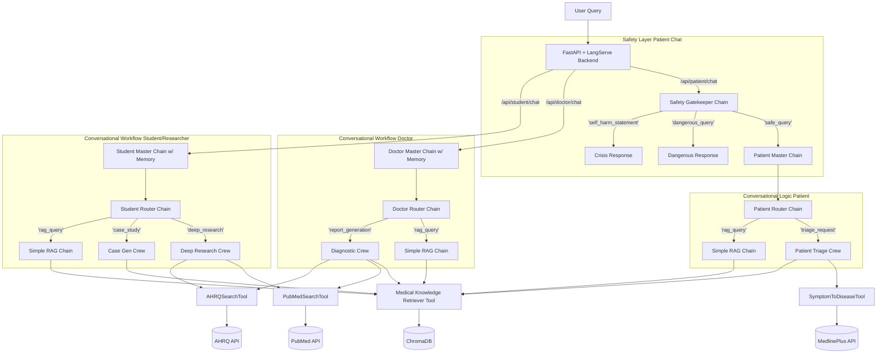

# MedAI: An Intelligent, Role-Based Medical Assistant

MedAI is a sophisticated, multi-agent AI platform designed to provide intelligent, safe, and reliable assistance to clinicians, patients, and medical students. Leveraging a state-of-the-art **RAG (Retrieval-Augmented Generation)** pipeline and a multi-layered conversational architecture, MedAI offers role-specific tools to enhance diagnostic processes, empower patients, and accelerate medical education.

This project is built with a production-ready mindset, featuring a **FastAPI backend**, containerization with **Docker**, and orchestration of multiple AI models and specialized agents.

---

## Table of Contents
- [Key Features](#-key-features)
- [For Clinicians](#for-clinicians)
- [For Patients](#for-patients)
- [For Students & Researchers](#for-students--researchers)
- [ Tech Stack & Architecture](#-tech-stack--architecture)
- [API Endpoints Documentation](#api-endpoints-documentation)
- [Patient Endpoints](#patient-endpoints)
- [Doctor Endpoints](#doctor-endpoints)
- [Student & Researcher Endpoints](#student--researcher-endpoints)
- [ Setup and Installation](#-setup-and-installation)
- [ Running the Application](#-running-the-application)

---

## Key Features

### For Clinicians
- **Intelligent Conversational Assistant**: Natural language interface to answer quick medical questions or initiate a full diagnostic workup.  
- **Automated Report Generation**: Multi-agent crew that analyzes patient data, queries PubMed & AHRQ, checks guidelines, and generates cited diagnostic reports.  
- **Specialized Research Tools**: Literature reviews, guideline searches, and on-demand summarization.  

### For Patients
- **Safe Triage System**: Empathetic AI that analyzes symptoms and recommends safe next steps.  
- **Advanced Safety Protocols**: Routes off-topic, dangerous, or crisis-related queries to appropriate responses.  
- **Automated Follow-up**: Integrated with **n8n** to schedule patient monitoring.  

### For Students & Researchers
- **Clinical Case Generator**: AI-driven synthetic case studies for training.  
- **Hybrid Research Assistant**: Conversational multi-modal agent for deep research, quizzes, and flashcards.  
- **Callable Specialist Agents**: Direct interaction with domain-specific agents (e.g., `SummarizationAgent`).  

---

## Tech Stack & Architecture

- **Backend Framework**: FastAPI with LangServe  
- **AI Orchestration**: LangChain (Runnables, Chains) & CrewAI  
- **Core Models**: GPT-4o, GPT-4o-mini, Gemini 1.5 Pro  
- **Vector Database**: ChromaDB (RAG)  
- **External APIs**: PubMed, AHRQ, NIH MedlinePlus  
- **Deployment**: Docker  
- **Automation**: n8n  

**System Architecture Diagram:**

---

API Endpoints Documentation
Patient Endpoints
1. Direct Triage Request
POST /api/patient/triage/invoke

Request Body:

{
  "input": {
    "symptom_description": "I have had a sharp pain in my chest and a fever for two days."
  }
}

2. Conversational Patient Chat
POST /api/patient/chat/invoke

Request Body:

{
  "input": "I have a headache.",
  "config": {
    "configurable": { "session_id": "unique_patient_session_123" }
  }
}

Doctor Endpoints
1. Direct Report Generation
POST /api/doctor/generate-report/invoke

Request Body:

{
  "input": {
    "symptoms": "Persistent morning headaches, blurred vision",
    "duration": "3 weeks",
    "severity": "Moderate",
    "medical_history": "Smoker, family history of hypertension",
    "additional_notes": "BP consistently above 160/95 mmHg",
    "current_date": "September 9, 2025"
  }
}

2. Conversational Doctor Chat
POST /api/doctor/chat/invoke

Request Body:

{
  "input": "Generate a report for a patient with persistent headaches for 3 weeks, a history of smoking, and a BP of 160/95.",
  "config": {
    "configurable": { "session_id": "unique_doctor_session_456" }
  }
}

Student & Researcher Endpoints
1. Direct Case Generation
POST /api/student/generate-case/invoke

Request Body:

{
  "input": {
    "medical_condition": "Type 1 Diabetes"
  }
}

2. Conversational Student Chat
POST /api/student/chat/invoke

Request Body:

{
  "input": "Create a 5-question quiz on the Krebs cycle.",
  "config": {
    "configurable": { "session_id": "unique_student_session_789" }
  }
}

⚙️ Setup and Installation
Clone the Repository
git clone https://github.com/fidelis3/grad.git
cd grad/AI_Backend/medai

Configure Environment Variables

Create a .env file in medai/ root:

OPENAI_API_KEY="sk-..."
GOOGLE_API_KEY="AIza..."
GEMINI_API_KEY="AIza..."
LANGCHAIN_TRACING_V2="true"
LANGCHAIN_API_KEY="ls__..."
LANGCHAIN_PROJECT="MedAI Project"
NCBI_EMAIL="your.email@example.com"
N8N_WEBHOOK_URL="https://..."

Install Dependencies

This project uses pyproject.toml:

crewai install

Activate environment:

.venv\Scripts\activate

Ingest Data
python -m src.medai.scripts.data_ingestion

 Running the Application
Locally
uvicorn src.medai.api.server:app --reload

API available at: http://127.0.0.1:8000

With Docker
docker build -t medai-app .
docker run -p 8000:8000 --name medai-container \
  -e OPENAI_API_KEY="your_key" \
  -e GOOGLE_API_KEY="your_key" \
  medai-app

---
