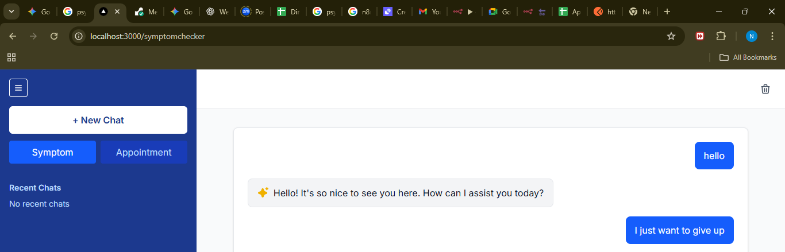

# MedAI: An Intelligent, Role-Based Medical Assistant

MedAI is a sophisticated, multi-agent AI platform designed to provide intelligent, safe, and reliable assistance to clinicians, patients, and medical students. Leveraging a state-of-the-art **RAG (Retrieval-Augmented Generation)** pipeline and a multi-layered conversational architecture, and **two n8n automations for patients.** MedAI offers role-specific tools to enhance diagnostic processes, empower patients, and accelerate medical education.

This project is built with a production-ready mindset, featuring a **FastAPI backend**, containerization with **Docker**, and orchestration of multiple AI models, specialized agents and n8n automtions.

---

## Table of Contents
- [Key Features](#key-features)
- [For Clinicians](#for-clinicians)
- [For Patients](#for-patients)
- [For Students & Researchers](#for-students--researchers)
- [Tech Stack & Architecture](#tech-stack--architecture)
- [System Automation and Workflow Explanation](#system-automation-and-workflow-explanation)
- [API Endpoints Documentation](#api-endpoints-documentation)
- [Patient Endpoints](#patient-endpoints)
- [Doctor Endpoints](#doctor-endpoints)
- [Student & Researcher Endpoints](#student--researcher-endpoints)
- [Setup and Installation](#setup-and-installation)
- [Running the Application](#running-the-application)

---

## Key Features

### For Clinicians
- **Intelligent Conversational Assistant**: Natural language interface to answer quick medical questions or initiate a full diagnostic workup.  
- **Automated Report Generation**: Multi-agent crew that analyzes patient data, queries PubMed & AHRQ, checks guidelines, and generates cited diagnostic reports.  
- **Specialized Research Tools**: Literature reviews, guideline searches, and on-demand summarization.  

### For Patients
- **Safe Triage System**: Empathetic AI that analyzes symptoms and recommends safe next steps.  
- **Advanced Safety Protocols**: Routes off-topic, dangerous, or crisis-related queries to appropriate responses.  
- **Automated Follow-up**: Integrated with **n8n** to schedule patient appointments, featuring an appointment through the appointment mode on the symptom checker page, and a special one in the symptom checker mode when a user's message is flagged off as a self_harm_statement during 'safety check', the user is prompted for appointment schedule with a Physchologist or counsellor.  

### For Students & Researchers
- **Clinical Case Generator**: AI-driven synthetic case studies for training.  
- **Hybrid Research Assistant**: Conversational multi-modal agent for deep research, quizzes, and flashcards.  
- **Callable Specialist Agents**: Direct interaction with domain-specific agents (e.g., `SummarizationAgent`).  

---

## Tech Stack & Architecture

- **Backend Framework**: FastAPI with LangServe  
- **AI Orchestration**: LangChain (Runnables, Chains) & CrewAI  
- **Core Models**: GPT-4o, GPT-4o-mini, Gemini 1.5 Pro  
- **Vector Database**: ChromaDB (RAG)  
- **External APIs**: PubMed, AHRQ, NIH MedlinePlus  
- **Deployment**: Docker  
- **Automation & Workflows**: n8n  

---

## System Automation and Workflow Explanation

MedAI is designed to operate through automated, role-specific workflows powered by both custom AI agents and external integrations, which include the 8n8 workflow. Below is an explanation of how the automation layers work:

1. **Safety Layer for Patient Interactions**  
   Every patient query is first analyzed by a **Safety Gatekeeper Chain**. This ensures that sensitive cases such as self-harm, emergencies, or unsafe medical advice are redirected appropriately:
   - Safe queries → forwarded to patient master workflow.  
   - Dangerous/off-topic queries → blocked with a safety-compliant response.  
   - Crisis/self-harm queries → forwarded to a **Crisis Workflow** in n8n, which alerts medical staff via email and sends an automatic reassurance email to the patient.

2. **Role-Specific Conversational Routing**  
   Depending on the endpoint used (patient, doctor, student), queries are routed into specialized chains and multi-agent crews:  
   - **Patient Router Chain** → triage crew (symptom analysis), RAG chain (knowledge retrieval), or n8n-based follow-ups.  
   - **Doctor Router Chain** → diagnostic crew (multi-step report generation), RAG search, or literature review.  
   - **Student Router Chain** → case generator crew, research assistant crew, or quiz generator.

3. **Integration with External APIs**  
   The system uses multiple medical knowledge bases:  
   - **PubMed API** → biomedical literature search.  
   - **AHRQ API** → evidence-based clinical guidelines.  
   - **NIH MedlinePlus API** → patient-friendly explanations.  
   Retrieved documents are embedded and stored in **ChromaDB**, enabling contextual retrieval through RAG.

4. **Automation via n8n**  
   The system uses n8n workflows for event-driven automation:

   ***4.1*** **Crisis alerts**: Immediate notification to clinicians with patient details. 

   Here is a step by step of how a sample crisis alert works:

  *1. The flow begins in the patient's chat UI. The user types a message that expresses clear self-harm intent*

    

  *2. Step 2: The AI Safety Gatekeeper*

   This message is sent to the conversational patient endpoint (/api/patient/chat). The very first component to see this message is the Safety Gatekeeper Chain.

   *Action:* Its SAFETY_ROUTER immediately classifies the intent as 'self_harm_statement'.

   *Result:* Instead of continuing to the normal chat logic, the SafetyBranch immediately diverts the request to the CrisisInterventionChain.

  *Step 3: The Structured Action Response*

   The CrisisInterventionChain does two things:

   - It uses an LLM to generate a unique, empathetic message based on the user's input.

   - It packages this message into a structured JSON "action" that is sent back to the frontend.

   API Response to Frontend:
   ```json
     {
     "output": {
       "action": "collect_crisis_details",
       "empathetic_message": "It sounds like you are going through a difficult time. Please know that there is help  available..."
     }
   }  
   ```

   

   If the user wishes, they enter there details and sends.

  *Step 6: The Backend Proxy*
   The frontend submits the form data to the dedicated, standard FastAPI endpoint: /api/report-crisis.

   *Action:* This endpoint is a simple and secure proxy. It takes the user's details and immediately adds a task to run in the background: trigger_n8n_crisis_webhook. This ensures the user gets an instant response from the API without waiting for the email to be sent.

   

   *Result:* The request is forwarded securely from the server to the n8n automation server.

  *Step 7: The n8n Automation (The Final Alert)*
   The n8n workflow receives the data package from the backend.

   *Action:* The "Webhook" node triggers, and the data flows to the "Send Alert Email" node.

   *Result:* This node instantly formats an email using the data it received (patient's name, email, and message) and sends it to the pre-configured email address of the on-call mental health professional assistant to schedule an appointment on behalf of the patient.

   The patient also receives an email, assuring em that someone will be in contact shortly.


  ***4.2*** **Appointment booking**: Patients can book appointments via conversational chat, routed through n8n for
  confirmation and data storage.  
   These workflows are triggered by FastAPI endpoints calling **n8n webhook URLs**.

   

  *4.2.1 Smart Appointment Booking: A User-Controlled System*
  This workflow showcases a user-controlled system that allows a patient to seamlessly switch between two independent, specialized AI assistants within a single chat interface: the Symptom Checker and the Appointment Booker.

  The entire process is managed by a mode state in the React frontend, which acts as a manual "switchboard," directing the user's messages to the correct backend service based on their explicit selection.

  *4.2.2 The Appointment Flow* 
   (The given examples features how everything can be conversational, but does not dictate that the user must follow all that. The automation is just supposed to collect all the necessary data before making an appointment, so if the user is not clear of their intent, the conversation is longer and if one is direct to the point, one can be finish it  faster)

  *1. The flow begins in the patient's chat UI. The user decides they want to book an appointment and uses the UI to switch modes.*

    *User Action:* The user clicks the "Appointment" button in the sidebar.

    *Frontend Action:* The onClick handler calls setMode('appointment'), instantly changing the UI's state. The "Appointment" button is now highlighted, and the text input placeholder changes to prompt for booking information.

  *2. Step 2: The First Interaction with the Booking AI*
   Now that the UI is in "Appointment" mode, the conversation is rerouted to the specialized n8n agent.

   *User Input:* "I would like to book an appointment"

   *Frontend Action:* The handleSendMessage function sees that mode === 'appointment' and sends the user's message to your backend proxy endpoint at /api/appointment/chat.

   *Backend Action:* The proxy endpoint securely forwards the message to the n8n webhook, initiating the conversation with the booking specialist.

   *Result:* The n8n AI receives its first message, follows its prompt (Booking Process, Step 1), and responds by asking the user to select a doctor from the available options.

  *3. Step 3: The Conversational Booking Process (n8n)*
   The user is now in a direct, stateful conversation with the n8n Appointment Booking AI. The AI uses its memory and tools to guide the user through the process.

   *User Input:* "Dr. Sarah Johnson. I am Nathaniel Wangai, My number is 0758942503, email adress nutnell00@gmail.com and I would like to set the appointment today"

   *n8n Action:* The AI Agent receives the message, uses its memory, and parses the details. It then follows its prompt to ask for the desired time.

  *4. Step 4: Tool Use - Checking Availability*
   The conversation continues, with the n8n agent using its tools to interact with real-world services.

    *User Input:* "today 6-7pm"

    *n8n Action:* The agent receives the time request. It uses its specialized "Check Availability" tool, which makes a  live API call to the doctor's Google Calendar to see if the 6-7 PM slot is free. The tool confirms availability and reports back to the agent.

    *Result:* The AI uses this information to formulate its final confirmation request to the user.

  *5. Step 5: The Automation Climax (Final Confirmation)*
    The user gives their final confirmation, triggering the workflow's automated actions.

    *User Input:* "Yes"

    *n8n Action:* The n8n agent receives the final confirmation and executes its full suite of action-oriented tools in  sequence:

    It uses the *"Create Event"* tool to book the appointment on Google Calendar.

    It uses the *"Add Data"* tool to log the appointment details in a Google Sheet.

    It uses its *email tools* to send out formatted confirmation emails to both the patient and the doctor.

    *Result:* The n8n agent sends its final, formatted confirmation message back to the user in the chat UI, completing the process.

5. **Persistence & Monitoring**  
   All conversations are tracked using session IDs, ensuring continuity across multiple messages. Logs are maintained for audit, research, and debugging purposes.

---

## API Endpoints Documentation

The MedAI backend exposes structured API endpoints under FastAPI, grouped by user role.

### Patient Endpoints

#### 1. Direct Triage Request  
`POST /api/patient/triage/invoke`

Request Body:
```json
{
  "input": {
    "symptom_description": "I have had a sharp pain in my chest and a fever for two days."
  }
}
```

#### 2. Conversational Patient Chat  
`POST /api/patient/chat/invoke`

Request Body:
```json
{
  "input": "I have a headache.",
  "config": {
    "configurable": { "session_id": "unique_patient_session_123" }
  }
}
```

#### 3. Crisis Reporting (Automated via n8n)  
`POST /api/patient/crisis-report`

Request Body:
```json
{
  "name": "Nutnell",
  "email": "nutnell30@gmail.com",
  "message": "I am fed up with everything. Everything is just chaotic."
}
```

Response: Triggers an n8n workflow that notifies the medical team and sends a reassurance email to the patient, and assuring them that someone will get in touch with them sooner.

---

### Doctor Endpoints

#### 1. Direct Report Generation  
`POST /api/doctor/generate-report/invoke`

Request Body:
```json
{
  "input": {
    "symptoms": "Persistent morning headaches, blurred vision",
    "duration": "3 weeks",
    "severity": "Moderate",
    "medical_history": "Smoker, family history of hypertension",
    "additional_notes": "BP consistently above 160/95 mmHg",
    "current_date": "September 9, 2025"
  }
}
```

#### 2. Conversational Doctor Chat  
`POST /api/doctor/chat/invoke`

Request Body:
```json
{
  "input": "Generate a report for a patient with persistent headaches for 3 weeks, a history of smoking, and a BP of 160/95.",
  "config": {
    "configurable": { "session_id": "unique_doctor_session_456" }
  }
}
```

---

### Student & Researcher Endpoints

#### 1. Direct Case Generation  
`POST /api/student/generate-case/invoke`

Request Body:
```json
{
  "input": {
    "medical_condition": "Type 1 Diabetes"
  }
}
```

#### 2. Conversational Student Chat  
`POST /api/student/chat/invoke`

Request Body:
```json
{
  "input": "Create a 5-question quiz on the Krebs cycle.",
  "config": {
    "configurable": { "session_id": "unique_student_session_789" }
  }
}
```

---

## Setup and Installation

### Clone the Repository
```bash
git clone https://github.com/fidelis3/grad.git
cd grad/AI_Backend/medai
```

### Configure Environment Variables
Create a `.env` file in the `medai/` root:

```bash
OPENAI_API_KEY="sk-..."
GOOGLE_API_KEY="AIza..."
GEMINI_API_KEY="AIza..."
LANGCHAIN_TRACING_V2="true"
LANGCHAIN_API_KEY="ls__..."
LANGCHAIN_PROJECT="MedAI Project"
NCBI_EMAIL="your.email@example.com"
N8N_WEBHOOK_URL="https://..."
```

### Install Dependencies
This project uses `pyproject.toml`:

```bash
crewai install
```

Activate environment:

```bash
.venv\Scripts\activate
```

### Ingest Data
```bash
python -m src.medai.scripts.data_ingestion
```

---

## Running the Application

### Locally
```bash
uvicorn src.medai.api.server:app --reload
```
API available at: `http://127.0.0.1:8000`

### With Docker
```bash
docker build -t medai-app .
docker run -p 8000:8000 --name medai-container   -e OPENAI_API_KEY="your_key"   -e GOOGLE_API_KEY="your_key"   medai-app
```
