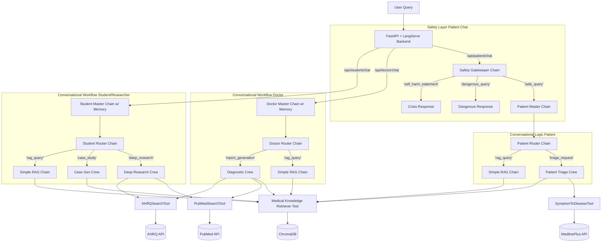

 MedAI System Architecture Blueprint v2
This blueprint outlines the final, sophisticated AI system architecture for the MedAI platform. It details the role-based, multi-layered conversational design, showing how user requests are safely processed and intelligently routed to the correct AI workflow.

1. High-Level Components
FastAPI & LangServe Backend: The production-ready entry point, serving both direct-action and intelligent conversational API endpoints for each user role.

Safety Gatekeeper Chain: A critical first layer that analyzes all incoming patient queries to classify and handle off-topic, dangerous, or self-harm-related messages before they reach the main logic.

Role-Based Conversational Master Chains: The "brains" for each user role (Doctor, Patient, Student). These stateful chains manage conversation history and use an intelligent router to dispatch tasks.

Intent Router Chains: Specialized LangChain components that use Few-Shot and Chain-of-Thought prompting to accurately classify a user's intent within a conversation.

CrewAI Crews: Four distinct, specialized multi-agent or single-agent systems that handle the most complex, multi-step tasks (Diagnostics, Triage, Case Generation, Deep Research).

Specialized Tools: A suite of custom tools that connect agents to live, authoritative external APIs (PubMed, AHRQ, MedlinePlus) and the internal RAG system.

ChromaDB Vector Database: The RAG foundation, containing two distinct collections: clinical_guidelines and student_knowledge.

2. GenAI Flow Diagram
This diagram illustrates the complete, multi-layered flow for a conversational request.

3. CrewAI Crews & Specialized Toolkits
Diagnostic Crew (MedaiCrew)

A multi-agent system for in-depth clinical analysis.

Differential Diagnosis Agent uses the SymptomToDiseaseTool (NIH MedlinePlus) to form hypotheses.

Research Agent uses the PubMedSearchTool to find the latest studies.

Guideline Compliance Agent uses the AHRQSearchTool for discovery and MedicalKnowledgeRetrieverTool for deep analysis of local guidelines.

Patient Triage Crew (PatientTriageCrew)

A single-agent crew with a safety-first "triage nurse" persona.

Uses the SymptomToDiseaseTool to find relevant health topics and the MedicalKnowledgeRetrieverTool for trusted educational content.

Case Generator Crew (CaseGeneratorCrew)

A single-agent "medical professor" that creates synthetic case studies.

Uses the full suite of research tools (PubMed, AHRQ, MedicalKnowledgeRetrieverTool) to ensure cases are realistic and evidence-based.

Deep Research Crew (ResearchCrew)

A multi-agent team for students and researchers.

Composed of a Literature Reviewer (PubMed), Guideline Analyst (AHRQ), and a lead Summarization Agent to synthesize findings.

4. MCP Contracts (API Inputs)
The API exposes a clear and standardized set of endpoints with validated Pydantic models.

# Direct Action Endpoint (e.g., for a UI button)
POST /api/patient/triage
Body: { "symptom_description": "..." }

# Conversational Endpoint (for a chat interface)
POST /api/doctor/chat
Body: {
  "input": "What are the contraindications for metformin?",
  "config": { "configurable": { "session_id": "unique_session_id" } }
}

POST /api/doctor/chat
Body: {
  "input": "Generate a report for a patient with...",
  "config": { "configurable": { "session_id": "unique_session_id" } }
}

5. Data Flow Example: A Complex Conversational Turn (Patient)
User: "I have a sharp pain in my chest and my arm feels numb."

API (/api/patient/chat): Receives the string.

Safety Gatekeeper Chain: The SafetyRouter classifies the query as 'safe_query' and passes it to the main logic.

Patient Master Chain:

The PatientRouter sees the message and classifies the intent as 'triage_request'.

The PatientBranch receives this routing decision.

It invokes the PatientTriageChain.

PatientTriageCrew:

The patient_triage_agent receives the symptoms.

It calls the SymptomToDiseaseTool (MedlinePlus API) to research "chest pain and arm numbness."

Based on the critical nature of the results, its prompt guides it to formulate a safe, urgent recommendation.

Response: The final, formatted markdown response advising the user to seek immediate medical attention is sent back through the API.