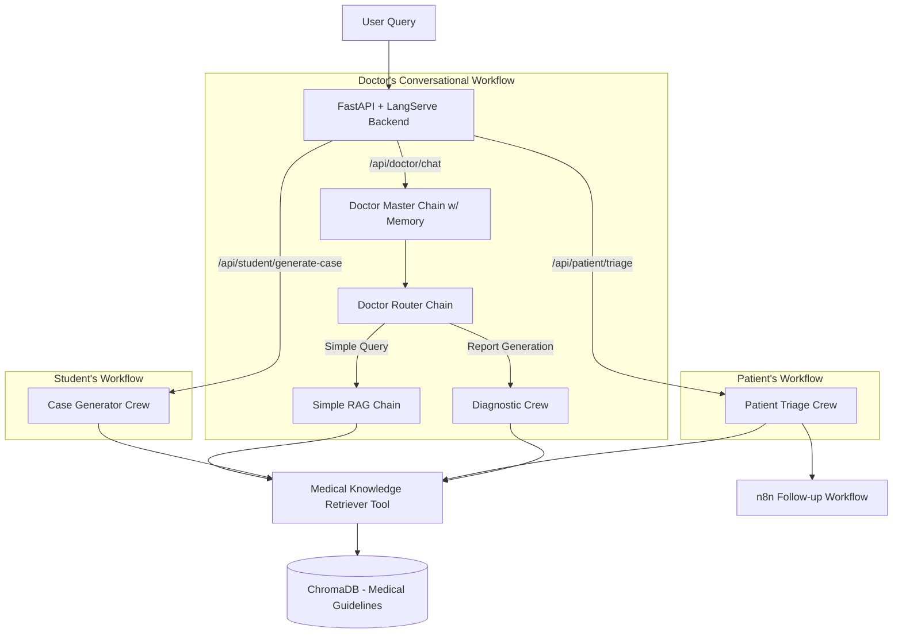

```mermaid
flowchart TB
    U[User Query] --> API[FastAPI + LangServe Backend]

    subgraph Doctor's Conversational Workflow
        API -- "/api/doctor/chat" --> DCM[Doctor Master Chain w/ Memory]
        DCM --> DR[Doctor Router Chain]
        DR -->|Simple Query| D_RAG[Simple RAG Chain]
        DR -->|Report Generation| DC[Diagnostic Crew]
    end

    subgraph Patient's Workflow
        API -- "/api/patient/triage" --> PT[Patient Triage Crew]
    end
    
    subgraph Student's Workflow
        API -- "/api/student/generate-case" --> SGC[Case Generator Crew]
    end
    
    DC --> MKR[Medical Knowledge Retriever Tool]
    PT --> MKR
    SGC --> MKR
    D_RAG --> MKR
    
    MKR --> VDB[(ChromaDB - Medical Guidelines)]
    PT --> N8N[n8n Follow-up Workflow]
```