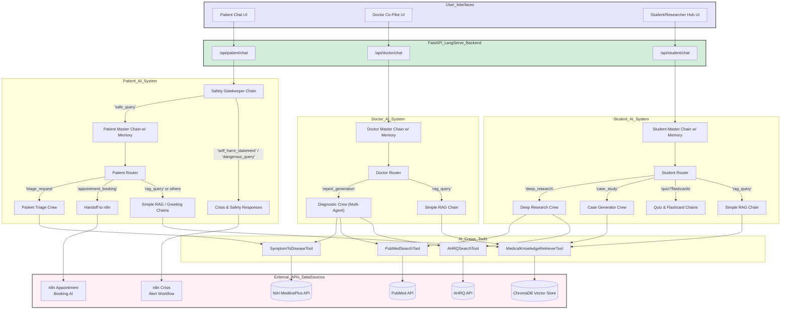

```mermaid
flowchart TB
    subgraph User_Interfaces
        direction LR
        PatientUI[Patient Chat UI]
        DoctorUI[Doctor Co-Pilot UI]
        StudentUI[Student/Researcher Hub UI]
    end

    subgraph FastAPI_LangServe_Backend
        direction TB
        PatientUI --> PatientChat["/api/patient/chat"]
        DoctorUI --> DoctorChat["/api/doctor/chat"]
        StudentUI --> StudentChat["/api/student/chat"]
    end

    subgraph Patient_AI_System
        direction TB
        PatientChat --> SafetyGatekeeper["Safety Gatekeeper Chain"]
        SafetyGatekeeper --> |"'safe_query'"| PatientMaster[Patient Master Chain w/ Memory]
        SafetyGatekeeper --> |"'self_harm_statement' / 'dangerous_query'"| CrisisResponse["Crisis & Safety Responses"]
        
        PatientMaster --> PatientRouter["Patient Router"]
        PatientRouter --> |"'triage_request'"| TriageCrew["Patient Triage Crew"]
        PatientRouter --> |"'appointment_booking'"| ApptHandoff["Handoff to n8n"]
        PatientRouter --> |"'rag_query' or others"| SimpleRAG1["Simple RAG / Greeting Chains"]
    end
    
    subgraph Doctor_AI_System
        direction TB
        DoctorChat --> DoctorMaster[Doctor Master Chain w/ Memory]
        DoctorMaster --> DoctorRouter["Doctor Router"]
        DoctorRouter --> |"'report_generation'"| DiagnosticCrew["Diagnostic Crew (Multi-Agent)"]
        DoctorRouter --> |"'rag_query'"| SimpleRAG2["Simple RAG Chain"]
    end

    subgraph Student_AI_System
        direction TB
        StudentChat --> StudentMaster[Student Master Chain w/ Memory]
        StudentMaster --> StudentRouter["Student Router"]
        StudentRouter --> |"'deep_research'"| ResearchCrew["Deep Research Crew"]
        StudentRouter --> |"'case_study'"| CaseGenCrew["Case Generator Crew"]
        StudentRouter --> |"'quiz'/'flashcards'"| ContentGen["Quiz & Flashcard Chains"]
        StudentRouter --> |"'rag_query'"| SimpleRAG3["Simple RAG Chain"]
    end

    subgraph AI_Crews_Tools
        direction LR
        TriageCrew --> SymptomTool["SymptomToDiseaseTool"]
        DiagnosticCrew --> SymptomTool
        DiagnosticCrew --> PubMedTool["PubMedSearchTool"]
        DiagnosticCrew --> AHRQTool["AHRQSearchTool"]
        ResearchCrew --> PubMedTool
        ResearchCrew --> AHRQTool
        SimpleRAG1 & SimpleRAG2 & SimpleRAG3 --> RAGTool["MedicalKnowledgeRetrieverTool"]
        CaseGenCrew --> RAGTool
    end

    subgraph External_APIs_DataSources
        direction LR
        SymptomTool --> NIH[(NIH MedlinePlus API)]
        PubMedTool --> PubMed[(PubMed API)]
        AHRQTool --> AHRQ[(AHRQ API)]
        RAGTool --> ChromaDB[(ChromaDB Vector Store)]
        ApptHandoff --> N8N_Appt["n8n Appointment<br>Booking AI"]
        CrisisResponse --> N8N_Crisis["n8n Crisis<br>Alert Workflow"]
    end

    style User_Interfaces fill:#e6e6fa,stroke:#333,stroke-width:2px
    style FastAPI_LangServe_Backend fill:#d4edda,stroke:#333,stroke-width:2px
    style External_APIs_DataSources fill:#fff0f5,stroke:#333,stroke-width:2px
```    
